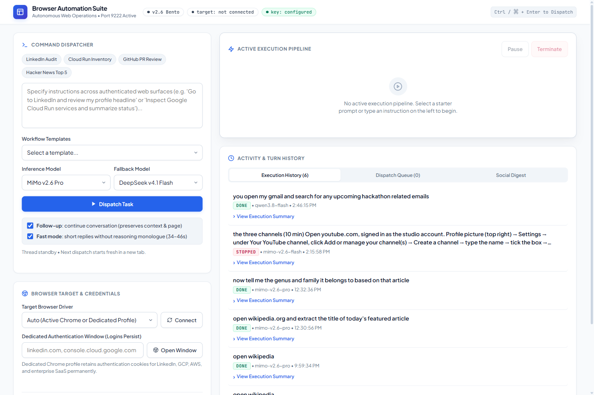
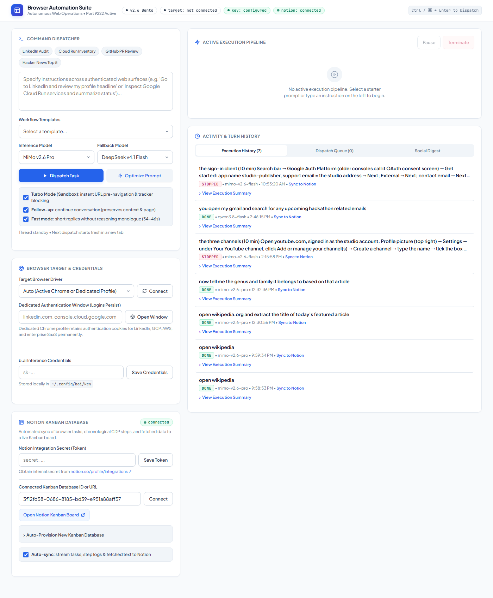
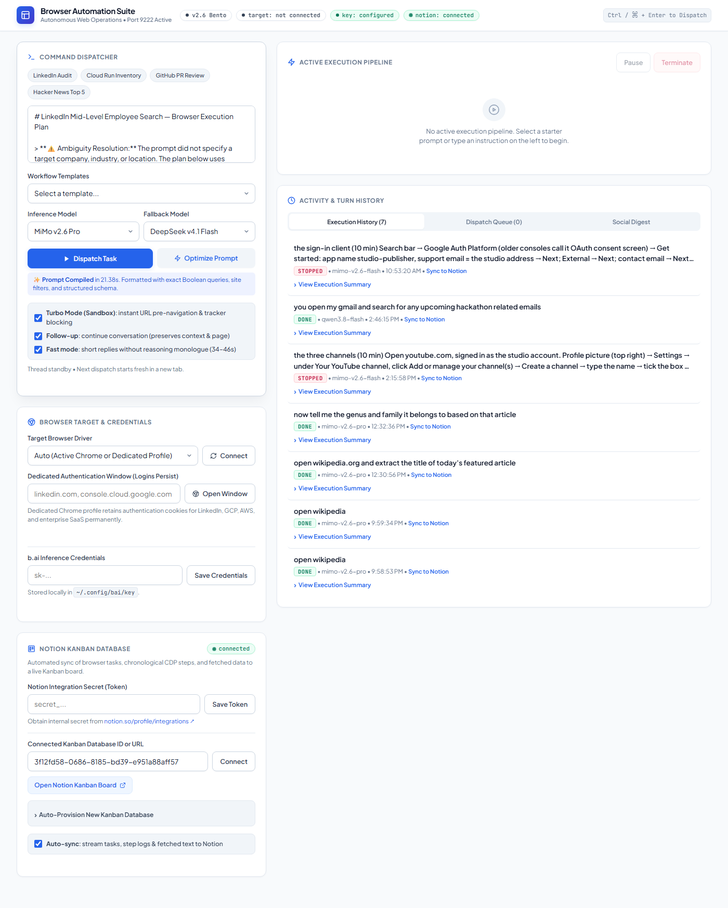
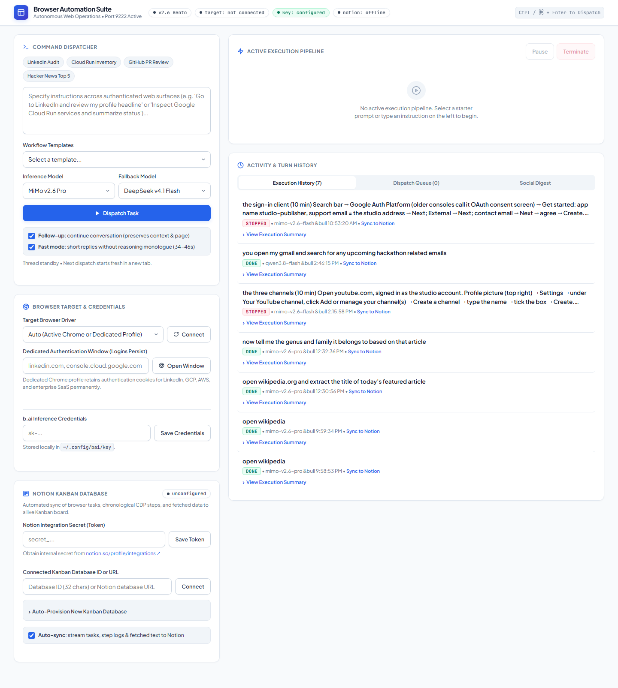
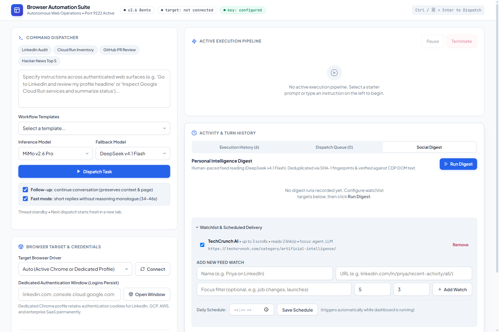
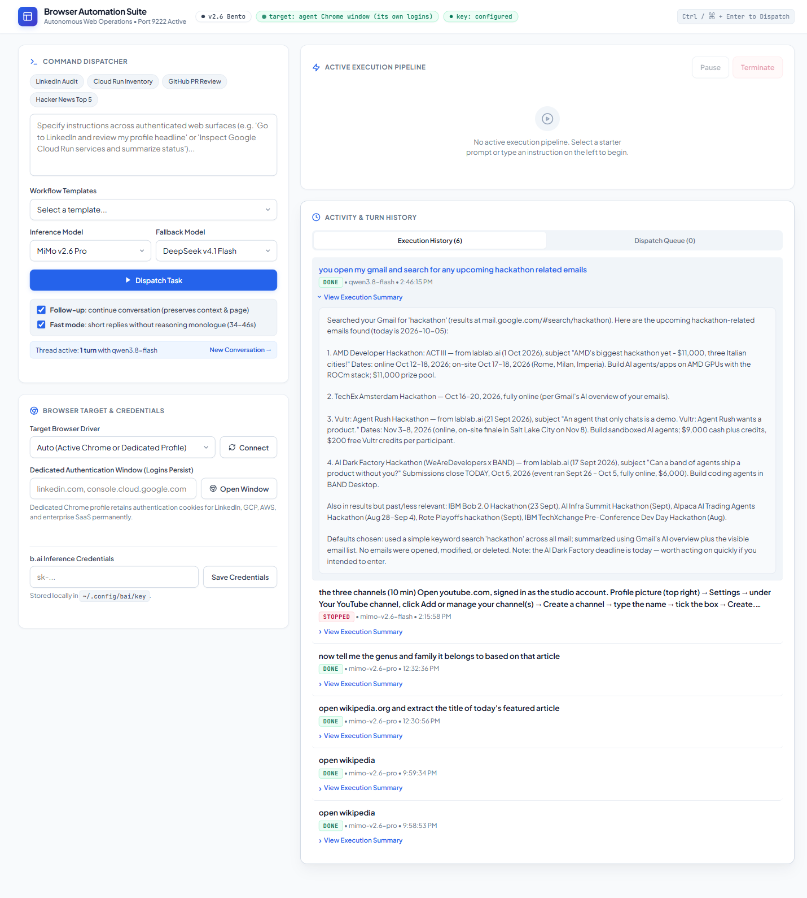

# Autonomous Browser Agent Suite (Port 8770)

[](https://www.python.org/downloads/)
[](https://opensource.org/licenses/MIT)
[](#operations-console-preview)
[](#notion-kanban-database-integration)
[](#key-capabilities)

An autonomous web operations suite with a developer-grade Bento Box console. Execute complex browser tasks across authenticated web applications (LinkedIn, Google Cloud, AWS, GitHub), maintain persistent sessions safely, monitor feeds with zero-hallucination verification, sync task execution logs & extracted data to a self-updating Notion Kanban database, and access your agent securely from your workstation, LAN, or mobile device.

---

## Operations Console Preview

### 1. Command Dispatcher & Active Pipeline
The primary interface provides 1-click starter prompts, workflow templates, inference model controls, multi-turn conversational thread memory, real-time live execution telemetry, and persistent profile authentication.



### 2. Sandboxed Turbo Mode & Fast Prompt Compiler
Toggle **Turbo Mode (Sandbox)** to instantly bypass the 30-second `about:blank` LLM discovery turn with zero code risk. Click **⚡ Optimize Prompt** to transform loose, conversational requests into high-precision, multi-phase execution blueprints with exact Boolean queries and extraction schemas.



### 3. Prompt Compiler Live Preview
The fast compiler analyzes unstructured requests (e.g. searching LinkedIn for multi-company recruiters and firing connection requests), automatically synthesizing Boolean search strings, field extraction tables, rate-limit guardrails, and structured markdown output schemas.



### 4. Notion Kanban Database & Live Step Streaming
Connect an existing Notion database or auto-provision a new Kanban board with 1 click. Tasks, real-time status transitions (`Queued` → `In Progress` → `Needs Human` → `Completed`), chronological CDP steps, and fetched content are automatically populated into Notion.



### 5. Personal Intelligence Digest & Watchlist
Read-only, human-paced feed scrolling with DeepSeek v4.1 Flash. The agent deduplicates posts via SHA-1 fingerprints, reads post links in background CDP tabs, and verifies extracted summaries against verbatim DOM body text.



### 6. Execution History & Interactive Summaries
Persistent turn history with real-time state caching, status chips (`DONE`, `FAILED`, `STOPPED`), `⚡ TURBO` and `✨ OPTIMIZED` execution tags, timing metrics, and non-jittery expandable execution summaries.



---

## Key Capabilities

### ⚡ 1. Sandboxed Turbo Mode (`turbo_mode=True`)
- **Instant Pre-Navigation (Turn 0)**: Deterministically parses destination URLs from user instructions (`youtube.com`, `linkedin.com`, `console.cloud.google.com`) and opens them immediately in the initial tab action. Eliminates the 20–40s blank-page DOM screenshot & evaluation delay.
- **CDP Ad & Tracker Suppression**: Uses Chrome DevTools Protocol `Network.setBlockedURLs` to silence tracking beacons (`*google-analytics.com*`, `*doubleclick.net*`, `*youtube.com/api/stats/*`, `*linkedin.com/li/track*`). Prevents streaming SPAs (YouTube, GCP) from stalling on `networkidle`.
- **Tuned Action Timings**: Page load wait reduced to `0.1s`, network idle wait to `0.2s`, action interval to `0.1s`.
- **Zero-Risk Sandbox Isolation**: Completely isolated behind a single UI toggle (`Turbo Mode (Sandbox)`). Unchecking it cleanly falls back to vanilla baseline behavior for side-by-side benchmarking.

### ✨ 2. Fast Prompt Optimizer / Instruction Compiler
- **Prompt Bottleneck Elimination**: Operator prompts are often underspecified or conversational. The compiler turns broad instructions into rigorous engineering blueprints in seconds.
- **Automated Boolean Synthesis**: Converts broad phrases like *"find mid level employees of uber, microsoft, stripe and their hr and hiring managers"* into exact search expressions:
  `"Uber" AND ("Talent Acquisition" OR "Recruiter" OR "HR Manager" OR "Hiring Manager" OR "People Operations")`
- **Multi-Phase Architecture**: Automatically formats instructions into Phase 1 (Navigation & Auth), Phase 2 (Filtering), Phase 3 (Extraction Schema Table), Phase 4 (Action & Modal Rules), and Safety Guardrails.

### ⚡ 3. Fast Mode (`flash_mode=True`), off by default
- Browser Use's flash mode: a 343-word system prompt instead of the full one, with no step-by-step self-check,
  planning or loop-breaking rules. Fine for short tasks ("open X and tell me Y").
- **Off by default since 2026-10-07.** On the local benchmark (`bench/`), it scored 26/71 against 71/71 with
  Fast off. It shortened every product name in a list (0/42 over two runs), and lost fields from a list of
  people. It was also no faster on long tasks. Details: `docs/reviews/2026-10-07-claude-accuracy.md`.

### 🧠 2. Multi-Turn Follow-Up Memory
- Preserves context, active tabs, and conversational thread history across multiple instructions.
- Execute chains like:
  1. *"Search LinkedIn for AI agent engineering updates."*
  2. *"Now summarize the third result and extract author details."*
- Click **New Conversation →** at any time to cleanly reset context and start fresh in a new tab.

### 🛡️ 3. Safe Persistent Authentication
- **Bot Detection Bypass**: `open_signin_window` launches a plain, non-automated Chrome profile in `~/.agent-chrome` without `--remote-debugging-port`. Sites like Google, LinkedIn, and banking portals allow standard login without bot-blocking flags.
- **Cookie Flush Guarantee**: The dashboard never force-terminates the sign-in window. Users log in, tick "keep me signed in", and close via the window's standard **✕** button, allowing Chrome to cleanly flush session cookies to disk without write race conditions.
- **Automation Interlock**: If a task starts while the sign-in window is open, the agent pauses with a handover prompt and waits for the user to close it.

### 📰 4. Social Digest & Anti-Hallucination Engine
- **Human-Paced Scrolling**: `scroll_feed` scrolls incrementally, pauses up to 2.4s for lazy-loaded feeds, and senses the true bottom of the page.
- **Background Link Reading**: `read_link` opens outbound links in an isolated CDP tab, captures the article title and text, closes the tab, and preserves the timeline scroll position without reload.
- **Anti-Hallucination Verification**: `verify(post, page_text)` compares model-reported quotes and named entities against raw `document.body.innerText` captured directly over CDP. Hallucinations are either replaced with verbatim text or flagged with red `unverified` pills.
- **Zero-Duplicate Fingerprinting**: Deduplicates posts using SHA-1 text n-grams and sanitized canonical URLs in `seen.json`.
- **Read-Only Safety Gate**: `Gate(read_only=True)` blocks all likes, comments, follows, connects, or posts during digests.

### 🌐 5. Home LAN & Mobile Access
- Binds to `0.0.0.0:8770` by default.
- **Zero-Config Localhost**: Workstation browser connects directly without security prompts.
- **Secure Network Access**: Connections across LAN / WiFi / Tailscale require the per-session token (`?token=...`). Unauthorized probes receive **HTTP 403 Forbidden**.
- Direct LAN URL with security token is printed in the terminal on startup.

### 📋 6. Notion Kanban Database & Live Step Streaming
<a id="notion-kanban-database-integration"></a>
- **5-Column Visual Workflow**:
  - `Queued`: Dispatched tasks awaiting execution.
  - `In Progress`: Active tasks navigating and executing in the browser.
  - `Needs Human`: Automatically moved here during 2FA, CAPTCHA, or confirmation pauses. Returns to `In Progress` when the operator responds.
  - `Completed`: Successfully finalized tasks.
  - `Failed`: Tasks that timed out or encountered unrecoverable CDP errors.
- **Rich Card Properties**: Automatically sets `Task` (title), `Status`, `Model`, `Category` (`Autonomous Task` vs `Social Digest`), `Duration (s)`, `Steps Count`, `Target URL`, and `Execution Date`.
- **Structured Card Content**:
  - **Executive Summary Callout**: Color-coded callout block summarizing outcomes.
  - **Task Instruction Quote**: Verbatim prompt preserved for auditing.
  - **Fetched & Extracted Content**: Complete body text, extracted summaries, or structured inventory.
  - **Execution Steps Breakdown**: Expandable chronological log of all CDP actions (click, type, scroll, navigate) and visited URLs.
- **1-Click Auto-Provisioning**: Enter any Notion parent page ID/URL and the agent constructs the full Kanban database schema via Notion REST API.
- **Historical Back-Sync**: Any past run in the Execution History can be synchronized to Notion with 1 click.
- **Zero Extra Dependencies**: Uses Python's native `urllib.request` against Notion REST API `v1` (`2022-06-28`). Zero bloat.

---

## Quick Start

### Windows (Recommended)
Double-click **`Start Browser Agent.cmd`** or run from PowerShell:
```powershell
powershell -ExecutionPolicy Bypass -File dashboard.ps1
```
*First run creates `.venv` and installs all dependencies automatically.*

### macOS / Linux
```bash
./dashboard.sh
```

### Direct Python Execution
```bash
# 1. Activate virtual environment
.\.venv\Scripts\Activate.ps1   # Windows
source .venv/bin/activate       # macOS/Linux

# 2. Launch dashboard
python dashboard.py
```

Console URL:
- Local Access: http://127.0.0.1:8770/ (the default: only this computer can reach it)
- LAN Access (opt-in): start with `DASHBOARD_HOST=0.0.0.0`, then open the `http://<YOUR_LAN_IP>:8770/?token=<TOKEN>` link
  printed at startup. Anyone on your network with that link can drive your logged-in browser, so use it only on a
  network you trust.

---

## Inference Models (`models.json`)

| Model | Mode | Vision | Optimal Use Case |
| :--- | :---: | :---: | :--- |
| **MiMo v2.6 Pro** *(Default)* | Pro | Enabled | Complex workflows, multi-step planning, high-accuracy reasoning |
| **DeepSeek v4.1 Flash** *(Fallback)* | Flash | Disabled | Ultra-fast digest extraction, text analysis, fallback execution |
| **Qwen 3.8 Flash** | Flash | Enabled | Spatial UI understanding, form completion |
| **MiMo v2.6 Flash** | Flash | Enabled | Rapid single-turn lookups |
| **GLM 5.3 Flash** | Flash | Enabled | General browser interaction |

---

## Human-in-the-Loop Safety Controls

The suite pauses and notifies the operator only when human agency is essential:

| Pause Trigger | Event | Action Required |
| :--- | :--- | :--- |
| **`ask_human`** | Ambiguity, choices, user input needed | Enter answer in dashboard input |
| **`hand_over`** | 2FA, passkey, CAPTCHA, login screen | Complete action in Chrome, click *Continue Execution* |
| **`confirm`** | High-impact actions (payment, delete, post, submit) | Click *Authorize* or *Decline* |

*Every pause triggers an audio tone, browser notification, and tab title pulse. Set `NTFY_TOPIC` for mobile alerts via [ntfy.sh](https://ntfy.sh).*

---

## REST API Reference

| Endpoint | Method | Parameters | Description |
| :--- | :---: | :--- | :--- |
| `/api/state` | GET | Header `X-Token` | Current system telemetry, active run, queue, model configurations |
| `/api/run` | POST | `{ task, model, fallback, follow_up, fast }` | Dispatches a new autonomous browser execution |
| `/api/control` | POST | `{ action: "pause"|"resume"|"stop"|"cancel", id? }` | Execution pipeline control |
| `/api/answer` | POST | `{ prompt_id, answer }` | Responds to an active human-in-the-loop prompt |
| `/api/signin` | POST | `{ url }` | Launches dedicated non-automated Chrome profile for persistent login |
| `/api/library` | GET | Header `X-Token` | Fetches watchlist targets, scheduler settings, and recent digest logs |
| `/api/watches` | POST | `{ action: "add"|"toggle"|"remove"|"schedule"|"run", ... }` | Manages social digest targets and triggers on-demand runs |
| `/api/new` | POST | `{}` | Resets multi-turn conversational context |
| `/api/notion/config` | POST | `{ token?, database_id?, auto_sync? }` | Tests and saves Notion API integration token and target database |
| `/api/notion/setup` | POST | `{ parent_id, title? }` | Auto-provisions a new 5-column Kanban database schema under a parent page |
| `/api/notion/sync` | POST | `{ id }` | Manually synchronizes an existing execution run and steps to Notion |

---

## Portable Distribution Bundle

For offline machines, remote servers, or home setups, use the standalone portable archive:
- **Archive Path**: `browser-automation-suite-portable.zip`
- **Installation**: Extract to any directory, run `Start Browser Agent.cmd`. No manual setup required.

---

## Working on this repo (humans and agents)

Two AI agents improve this product in parallel. Read **[AGENTS.md](AGENTS.md)** before changing anything, log every
change in **[CHANGELOG.md](CHANGELOG.md)**, and run `python tests/test_offline.py` before pushing. Design reasons,
benchmarks and the test record are in **[docs/ENGINEERING.md](docs/ENGINEERING.md)**. Reviews of each other's
changes go in [docs/reviews/](docs/reviews/).

## Repository & Git Maintenance

This repository is maintained with clean git hygiene:
- Credentials, local Chrome profiles (`~/.agent-chrome`), API keys, and runtime logs are strictly gitignored.
- Remote repository synchronization:
  ```powershell
  git add .
  git commit -m "feat: description of update"
  git push origin main
  ```
